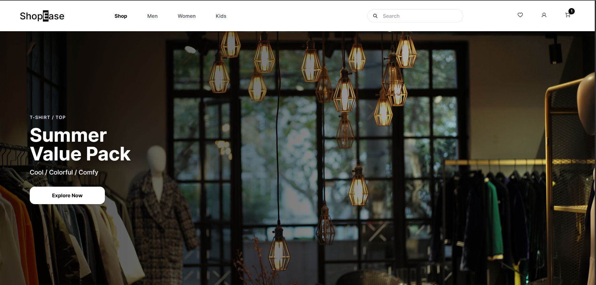
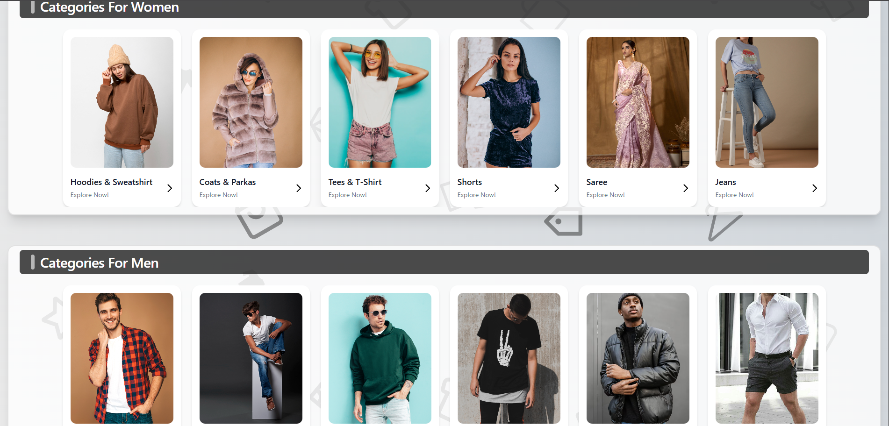
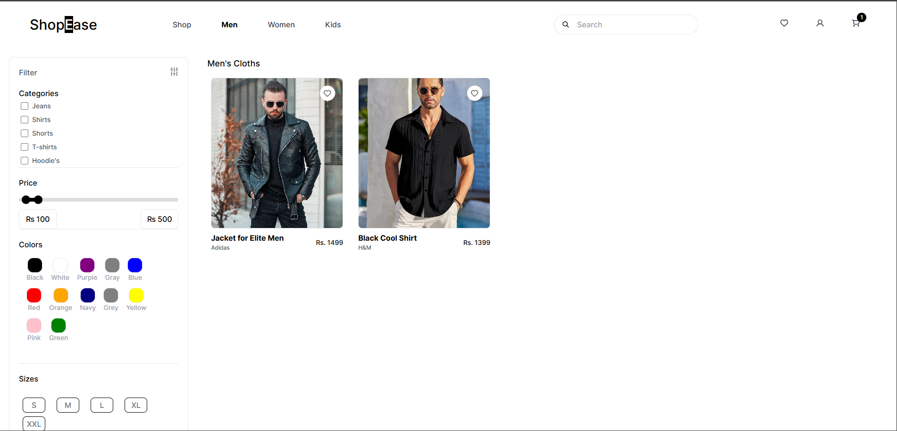
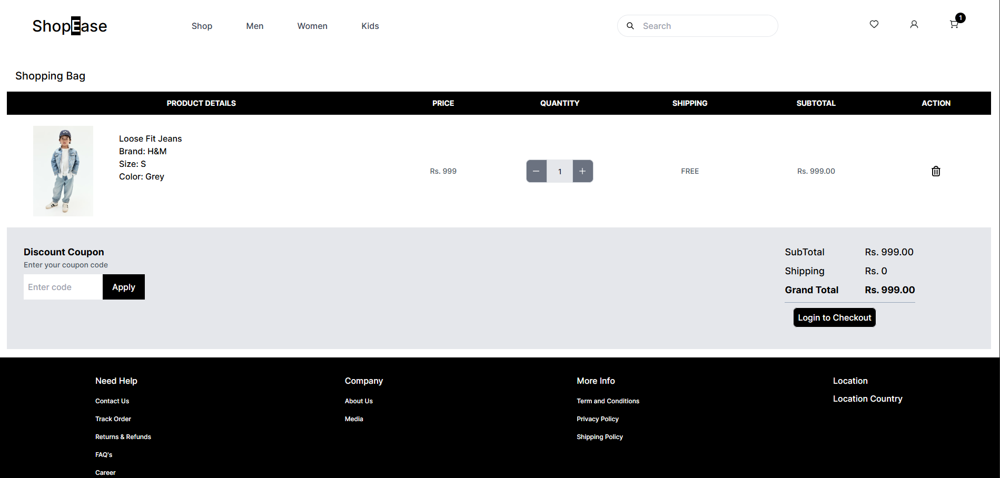

## 🛍️ ShopEase
A one-stop platform for all your fashion needs — discover, shop, and manage everything effortlessly.

### 🚀 Features
- 👕 Browse products by category, price, and brand  
- ❤️ Wishlist and Cart management  
- 🔐 Secure user authentication (JWT + OAuth2 Google Login)  
- 💳 Stripe payment integration  
- ☁️ Cloudinary image storage  
- 📦 Order tracking and management  
- 📧 Email notifications for orders and sign-ups  
- 🧩 RESTful API built with Spring Boot  

### 🛠️ Tech Stack
- **Frontend:** React Js, Tailwind CSS, JavaScript
- **Backend:** Spring Boot (Java 17)  
- **Database:** PostgreSQL  
- **Authentication:** JWT, OAuth2  
- **Cloud:** Cloudinary  
- **Payment Gateway:** Stripe  
- **Environment Config:** Dotenv  
- **API Docs:** SpringDoc OpenAPI (Swagger UI)

### ⚙️ Setup Instructions
1. Clone the repository  
```bash
git clone https://github.com/Nikhil-keshri2213/ShopEase_Backend.git
cd ShopEase_Backend
```

2. Create a .env file with your credentials
```
GOOGLE_CLIENT_ID=your_client_id  
GOOGLE_CLIENT_SECRET=your_client_secret  
STRIPE_SECRET_KEY=your_stripe_key  
CLOUDINARY_URL=your_cloudinary_url  
```

3. Run the application
```
mvn spring-boot:run
```

### 📚 API Documentation

- Visit Swagger UI:
```
http://localhost:8080/swagger-ui.html
```

### 📸 Glimpse of ShopEase








# More Updates is coming soon.....!